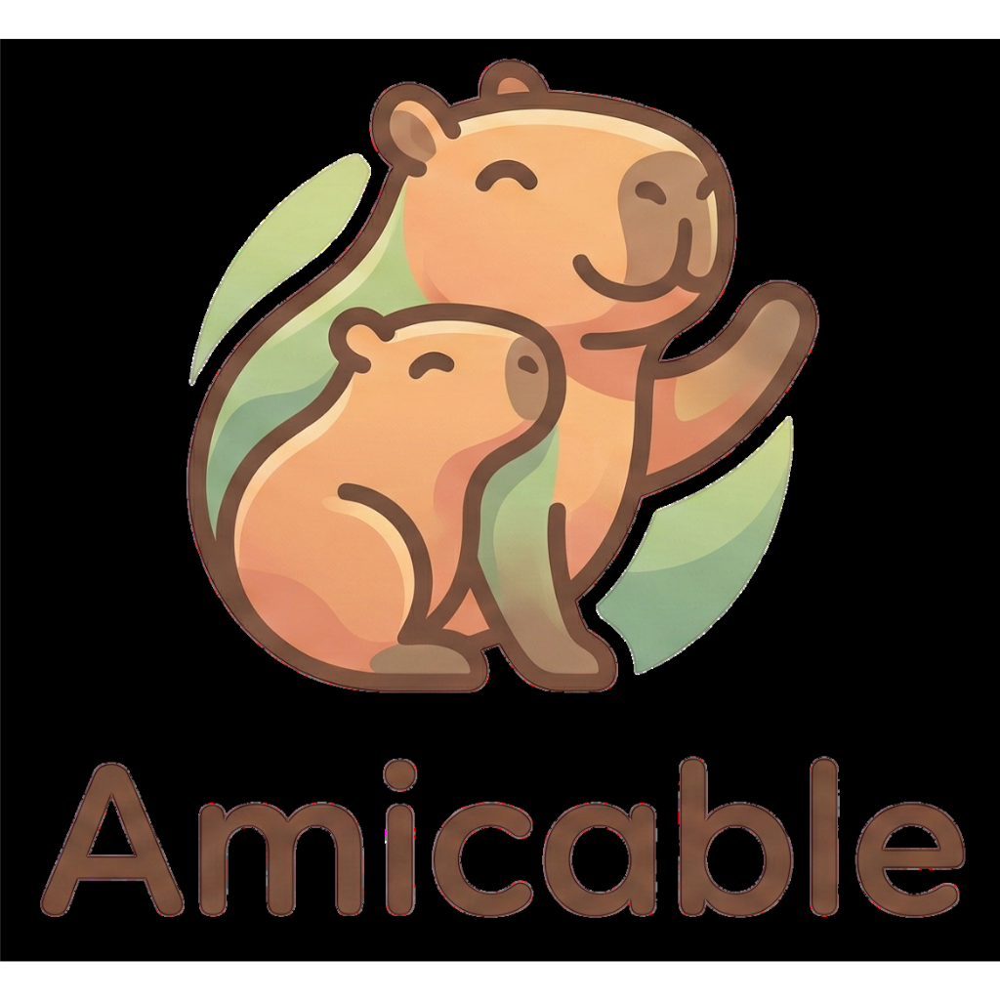

<p align="center">
  
</p>

<h1 align="center">Amicable</h1>

<p align="center">
  <strong>AI-powered web app builder.</strong><br/>
  Describe what you want, watch it come to life.
</p>

---

Amicable lets you build web applications through conversation. Type a prompt in the editor, and an AI agent writes the code in an isolated sandbox while you watch a live preview update in real time.

## How It Works

```
Browser (Editor)
    | WebSocket
Agent (FastAPI + DeepAgents)
    | HTTP
Sandbox Pod (Kubernetes)
    |-- Runtime API :8888  (file I/O, shell)
    '-- Vite Dev Server :3000  (live preview)
```

1. You open the editor and describe what you want to build
2. The agent receives your prompt over WebSocket
3. A per-session Kubernetes sandbox is provisioned automatically
4. The agent reads, writes, and executes commands in the sandbox
5. After edits, deterministic QA (lint, typecheck, build) validates the result
6. If QA fails, the agent self-heals and retries
7. You see the result in a live preview iframe

## Features

- **Conversational UI** -- chat with the agent to iteratively build your app
- **Live preview** -- see changes instantly via an embedded Vite dev server
- **Isolated sandboxes** -- each session gets its own Kubernetes pod
- **Per-app database (optional)** -- each app can get its own Postgres schema exposed through Hasura via an agent proxy
- **Deterministic QA** -- automated lint, typecheck, and build checks after every edit
- **Self-healing** -- the agent automatically fixes QA failures
- **Human-in-the-loop approvals (HITL)** -- optional approvals for tool calls (used by default for destructive operations)
- **Google OAuth** -- optional authentication for multi-user deployments
- **Responsive device preview** -- toggle between mobile, tablet, and desktop views

## Quick Start

### Prerequisites

- Python 3.12+
- Node.js 20+
- Kubernetes cluster with [agent-sandbox](https://github.com/Mayflower/agent-sandbox) CRDs
- `ANTHROPIC_API_KEY`

### Install

```bash
git clone https://github.com/mayflower/amicable
cd amicable
pip install -r requirements.txt

cd frontend
npm install
```

### Configure

Create `frontend/.env`:

```bash
VITE_AGENT_WS_URL=wss://your-agent-host/
```

### Run locally

```bash
cd frontend
npm run dev
```

The editor connects to your deployed agent via WebSocket. For the agent itself, see [Deployment](#deployment).

## Deployment

Amicable runs on Kubernetes with a Helm chart:

```
deploy/helm/amicable/
```

It deploys four components:

| Component | Description |
|-----------|-------------|
| **Agent** | FastAPI/Uvicorn WebSocket server |
| **Editor** | Static Vite/React SPA served by nginx |
| **Preview Router** | nginx wildcard proxy for sandbox previews |
| **Sandbox** | Per-session pod (SandboxClaim CRD) |

See:
- [Kubernetes install guide](docs/kubernetes.md)
- [Developer guide](DEVELOPMENT.md)
- [Debugging runbook](docs/debugging.md)

### Google OAuth (optional)

Set on the agent:

```bash
AUTH_MODE=google
GOOGLE_CLIENT_ID=...
GOOGLE_CLIENT_SECRET=...
SESSION_SECRET=...           # random string, keep stable
PUBLIC_BASE_URL=https://your-agent-host
CORS_ALLOW_ORIGINS=https://your-editor-host
AUTH_REDIRECT_ALLOW_ORIGINS=https://your-editor-host
```

## Architecture

The agent uses [DeepAgents](https://github.com/mayflower/deepagents) (LangGraph-based) with filesystem and shell tools. An outer controller graph wraps every edit with deterministic QA. The agent can also expose an optional per-app database via Hasura through an authenticated proxy endpoint.

1. **Edit** -- DeepAgents implements the user's request
2. **QA** -- runs `lint`, `typecheck`, `build` in the sandbox
3. **Self-heal** -- on failure, feeds QA output back to the agent (up to N retries)

Key configuration:

| Variable | Default | Description |
|----------|---------|-------------|
| `DEEPAGENTS_MODEL` | `anthropic:claude-sonnet-4-5-20250929` | LLM model |
| `DEEPAGENTS_QA` | `true` | Enable deterministic QA |
| `DEEPAGENTS_QA_TIMEOUT_S` | `600` | QA command timeout |
| `DEEPAGENTS_SELF_HEAL_MAX_ROUNDS` | `2` | Max self-heal retries |
| `DEEPAGENTS_MEMORY_SOURCES` | `"/AGENTS.md,/.deepagents/AGENTS.md"` | Memory files loaded into the agent prompt |
| `DEEPAGENTS_SKILLS_SOURCES` | `"/.deepagents/skills,/skills"` | Skills directories loaded by DeepAgents |
| `DEEPAGENTS_MODEL_RETRY_MAX_RETRIES` | `2` | Model retry middleware retries |
| `DEEPAGENTS_TOOL_RETRY_MAX_RETRIES` | `2` | Tool retry middleware retries |
| `DEEPAGENTS_HITL_INTERRUPT_ON_JSON` | `{}` | HITL interrupt mapping (empty means no interrupts) |
| `AMICABLE_TRACE_NARRATOR_ENABLED` | `false` | Optional tool-trace narrator (adds short explanations after tool calls) |
| `AMICABLE_TRACE_NARRATOR_MODEL` | `anthropic:claude-haiku-4-5` | Narrator model |
| `AMICABLE_TRACE_NARRATOR_MAX_CHARS` | `280` | Narrator maximum explanation length |

### GitLab Persistence (Optional)

If configured, the agent persists each project to GitLab as a repository and pushes snapshot commits after each controller run (after QA success or QA failure).

Enable by setting:
- `GITLAB_TOKEN` (required)

Common optional env vars:
- `GITLAB_BASE_URL` (default `https://git.mayflower.de`)
- `GITLAB_GROUP_PATH` (default `amicable`)
- `AMICABLE_GIT_SYNC_ENABLED` (default: enabled iff token present)
- `AMICABLE_GIT_AGENT_README_POLICY_ENABLED` (default `true`; warn-only README policy on agent-generated commits)

Commit documentation policy:
- The first bootstrap commit includes a short description of what the project is about, derived from the project creation prompt.
- Agent-generated commits emit a warning in the commit body when non-doc files changed without updating `README.md` or `docs/index.md`.
- This policy is warn-only and does not block commit/push.

Implementation lives in `src/gitlab/` and failures are best-effort (do not block the edit loop).

### HITL (Human-in-the-loop)

The agent supports pausing execution for approval at specific tool calls. The frontend renders an approval panel and sends a response to resume the controller graph.

Message types:
- server -> client: `hitl_request`
- client -> server: `hitl_response`

Default behavior:
- HITL is mostly disabled by default (`DEEPAGENTS_HITL_INTERRUPT_ON_JSON={}`).
- Destructive operations are still guarded:
  - destructive shell deletes are interrupted before execution
  - destructive DB ops (`db_drop_table`, `db_truncate_table`) are interrupted before execution

### Tool Trace (Tool Calls)

The agent streams a full tool call trace over WebSocket so the UI can render an "Actions" log (tool name, input, output, errors).

Message types:
- server -> client: `trace_event`

Note:
- The tool trace is *not* model chain-of-thought; it is structured runtime events from tool execution.
- The agent also emits a short `reasoning_summary` trace event (a sidecar summary of observable actions, not chain-of-thought).
- If `AMICABLE_TRACE_NARRATOR_ENABLED=true`, the agent emits additional `trace_event` items with short user-facing explanations and may improve the reasoning summary using a cheap model.

Common `trace_event.phase` values:
- `tool_start`, `tool_end`, `tool_error`
- `tool_explain` (sidecar narrator enabled)
- `reasoning_summary` (always)

### Generative UI (Optional)

The model may include small UI payloads inside assistant messages using fenced blocks:

````text
```ui
{"type":"steps","title":"Plan","steps":["...","..."]}
```
````

The editor parses these blocks and renders them above the assistant message (and hides the raw JSON from the chat bubble).

### Database (Hasura, optional)

When configured, each app gets:
- a dedicated Postgres schema (`app_<sha12(app_id)>`)
- a dedicated Hasura role (`app_<sha12(app_id)>`)
- a browser-facing GraphQL URL on the agent: `/db/apps/<app_id>/graphql`

On session init, the agent injects:
- `/app/amicable-db.js` with `window.__AMICABLE_DB__ = { appId, graphqlUrl, appKey }`
- a `<script src="/amicable-db.js"></script>` tag into `/app/index.html` (idempotent)

Agent env vars required for DB:
- `HASURA_BASE_URL`
- `HASURA_GRAPHQL_ADMIN_SECRET` (for `run_sql` + metadata)
- `HASURA_GRAPHQL_JWT_SECRET` (for minting short-lived JWTs used by the proxy)
- `HASURA_SOURCE_NAME` (default `default`)
- `AMICABLE_PUBLIC_BASE_URL` (used to build the full `graphql_url` returned to the client)
- `AMICABLE_DB_PROXY_ORIGIN_MODE` (default `strict_preview`)

## Development

```bash
# Python
pytest                           # run tests
python3 -m compileall -q src     # syntax check
ruff check src/                  # lint
ruff format src/                 # format

# Frontend
cd frontend
npm run dev                      # dev server
npm run build                    # production build
npm run lint                     # eslint
```

## License

See [LICENSE](LICENSE) for details.
